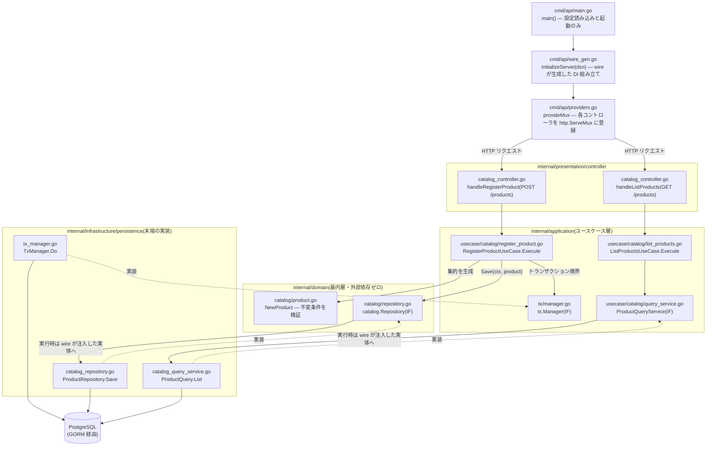

# golang-ddd-sample

Go で DDD(ドメイン駆動設計)の戦術パターンを学ぶためのサンプルリポジトリです。EC(ネットショップ)を題材に、商品カタログ・カート・注文・顧客・在庫・配送・クーポンの 7 コンテキストをオニオンアーキテクチャ + 軽量 CQRS で実装しています。読んで学ぶことを主目的にしており、すべてのコードに日本語の解説コメントを付けています。

## 技術スタック

- Go(標準 `net/http`、Go 1.22+ のメソッド付きルーティング)
- GORM + PostgreSQL(永続化)
- almondoo/wire(コンパイル時 DI コード生成)
- 外部フレームワークはドメイン層に持ち込まない方針

## 動かし方

コードリーディングだけであればビルドとテストのみで完結します。DB は不要です。

```sh
go build ./...
go test ./...
```

API サーバーとして起動する場合は PostgreSQL を用意し、DSN を環境変数で渡します。

```sh
export DATABASE_DSN="host=localhost user=postgres password=postgres dbname=ddd_sample port=5432 sslmode=disable"
go run ./cmd/api
```

依存の組み立て(`cmd/api/wire.go` のプロバイダ宣言)を変更した場合は、wire で組み立てコードを再生成します。

```sh
go run github.com/almondoo/wire/cmd/wire ./cmd/api
```

## ディレクトリ構成

```
.
├── cmd/api/                     # エントリポイント
│   ├── main.go                  # 設定読み込みと起動のみ
│   ├── wire.go                  # DI の設計図(プロバイダの宣言)
│   └── wire_gen.go              # wire が生成した組み立てコード
├── docs/
│   ├── context-map.md           # コンテキストマップ(戦略的設計)、ID 型対照表
│   ├── execution-flow.md        # リクエスト実行順序の図解
│   ├── ddd-research.md          # DDD 原則の出典検証済みリサーチ
│   ├── ddd/                     # DDD の構成要素を1要素=1ファイルで解説
│   └── specs/                   # DDD 原則との突き合わせ監査結果・改善スペック
├── internal/
│   ├── domain/                  # ドメイン層(最内層・外部依存ゼロ)
│   │   ├── shared/              # 共有カーネル: Money、共通エラーなど
│   │   ├── catalog/             # 商品カタログ: Product 集約、値オブジェクト、リポジトリIF
│   │   ├── cart/                # カート: Cart 集約、CartItem、数量などの不変条件
│   │   ├── order/               # 注文: Order 集約、状態遷移、クーポン割引
│   │   ├── customer/            # 顧客: Customer 集約、Address(子エンティティ)
│   │   ├── inventory/           # 在庫: Stock 集約、引当/解放/消込
│   │   ├── shipping/            # 配送: Shipment 集約、状態遷移
│   │   └── coupon/              # クーポン: Coupon 集約、金額/割合割引
│   ├── application/             # ユースケース層(1ファイル = 1ユースケース)
│   │   ├── tx/                  # トランザクション境界のポート(インターフェース)
│   │   └── usecase/
│   │       ├── catalog/         # 商品登録・価格改定(command)、一覧・詳細取得(query)
│   │       ├── cart/            # カートへの追加・削除(command)、カート取得(query)
│   │       ├── order/           # 注文確定・支払い・発送・キャンセル(command)、注文詳細取得(query)
│   │       ├── customer/        # 顧客登録・住所追加/デフォルト変更/削除(command)、顧客詳細取得(query)
│   │       ├── inventory/       # 在庫数設定(command)、在庫詳細取得(query)
│   │       ├── shipping/        # 配達完了(command)、配送詳細取得(query)
│   │       └── coupon/          # クーポン発行(command)、クーポン詳細取得(query)
│   ├── infrastructure/          # 技術詳細(最外層)
│   │   └── persistence/         # GORM モデル、リポジトリ実装、クエリサービス実装
│   └── presentation/
│       └── controller/          # HTTP コントローラ、ルーティング、エラー→ステータス変換
└── README.md
```

各層の役割と設計判断は、それぞれのディレクトリ直下の README で解説しています。

- [internal/domain/README.md](internal/domain/README.md) — 依存方向のルール、集約・値オブジェクト・リポジトリIF
- [internal/application/README.md](internal/application/README.md) — command / query の分離(ファイル名・依存の形で区別)、トランザクション境界、コンテキストをまたぐ直接呼び出し
- [internal/infrastructure/README.md](internal/infrastructure/README.md) — ドメインモデルと GORM モデルの分離(データマッパー)
- [internal/presentation/README.md](internal/presentation/README.md) — DTO 変換、エラーマッピング

## エントリポイントから末端の実装まで

1 本のリクエストが `main.go` から PostgreSQL まで、どのファイルのどの関数を経由して届くかを catalog コンテキストを例に示します。実線は実行時の呼び出し、点線はインターフェースの実装関係(依存はつねに内側へ向く)です。左の command は domain 層の集約を経由し、右の query は domain 層を迂回して DTO を直接組み立てます(軽量 CQRS)。



domain 層のインターフェース(`catalog.Repository`)と infrastructure 層の実装(`ProductRepository`)の対応づけは、起動時に `initializeServer` が済ませています。そのため実行時にユースケースが呼ぶのはインターフェースだけで、末端の GORM 実装を知ることはありません。command / query それぞれの詳細なシーケンス図は [docs/execution-flow.md](docs/execution-flow.md) を参照してください。

## API エンドポイント

| メソッドとパス | ユースケース | 種別 |
|---|---|---|
| `POST /products` | 商品を登録する | command |
| `GET /products` | 商品一覧を取得する | query |
| `GET /products/{id}` | 商品詳細を取得する | query |
| `PUT /products/{id}/price` | 価格を改定する | command |
| `GET /carts/{customerID}` | カート内容を取得する | query |
| `POST /carts/{customerID}/items` | カートに商品を追加する | command |
| `DELETE /carts/{customerID}/items/{productID}` | カートから商品を除く | command |
| `POST /orders` | カートの内容から注文を確定する(`couponCode` は任意) | command |
| `GET /orders/{id}` | 注文詳細を取得する | query |
| `POST /orders/{id}/pay` | 支払いを記録する(状態遷移) | command |
| `POST /orders/{id}/ship` | 発送を記録する(状態遷移)。レスポンスは `200 {"shipmentId": "..."}` | command |
| `POST /orders/{id}/cancel` | 注文をキャンセルする(在庫の引当解除・クーポン利用実績の返却を含む) | command |
| `POST /customers` | 顧客を登録する | command |
| `GET /customers/{id}` | 顧客詳細(住所を含む)を取得する | query |
| `POST /customers/{id}/addresses` | 顧客に配送先住所を追加する | command |
| `PUT /customers/{id}/addresses/{addressID}/default` | デフォルト住所を変更する | command |
| `DELETE /customers/{id}/addresses/{addressID}` | 住所を削除する | command |
| `PUT /products/{id}/stock` | 商品の在庫数を設定する | command |
| `GET /products/{id}/stock` | 商品の在庫を取得する | query |
| `GET /shipments/{id}` | 配送詳細を取得する | query |
| `POST /shipments/{id}/deliver` | 配達完了を記録する(状態遷移) | command |
| `POST /coupons` | クーポンを発行する | command |
| `GET /coupons/{code}` | クーポン詳細を取得する | query |

`POST /orders` のリクエストボディは `{"customerId": "...", "couponCode": "..."}` です。`couponCode` は任意項目で、省略(空文字列)すればクーポンを適用せずに注文を確定します。

## このサンプルの学習ポイント

**ドメイン層の純粋性。** ドメイン層は GORM も HTTP も知りません。永続化のための struct(GORM タグ付き)は infrastructure 側に置き、ドメインモデルと相互変換します。ORM の都合がビジネスルールの表現を歪めないための分離です。

**軽量 CQRS の非対称性。** command はドメインモデルを経由して不変条件を守りながら書き込み、query はドメインを迂回して GORM から直接 DTO を組み立てます。「読み取りに集約の保護は不要」という判断を、あえて非対称なコードで示しています。

**値オブジェクトによる primitive obsession の回避。** `Money`(負値と通貨不一致を拒否)、各種 ID 型(UUID のラッパー)で、`int64` や `string` の生値がドメインを流れることを防ぎます。

**直接呼び出しによるコンテキスト間連携。** 注文確定ユースケースが application 層で cart を直接操作する設計にし、コンテキスト間連携を最短の形で示しています(ドメインイベント + 購読による疎結合化は発展形として docs で言及しています)。

**トランザクション境界はユースケースが決める。** リポジトリは自分でトランザクションを張らず、`tx.Manager` が context 経由で伝搬するトランザクションに参加します。

**依存の組み立ては composition root に集約。** controller は command / query を問わず必ず usecase を経由し、その依存関係は `cmd/api/wire.go` に宣言して wire がコンパイル時にコード生成します。配線ミスが実行時エラーではなくコンパイルエラーとして検出できます。

**集約の見本: Customer + Address。** `customer` コンテキストは「集約ルート経由でしか子エンティティを操作させない」という DDD の定石をもっとも分かりやすい形で示しています。`Address` は独自の識別子(`AddressID`)を持つ子エンティティですが、生成・変更はすべて `Customer` のメソッド(`AddAddress` / `ChangeDefaultAddress` / `RemoveAddress`)を経由します。「デフォルト住所は住所が1件でもあれば必ずちょうど1つ存在する」という不変条件は、兄弟にあたる他の住所の状態を横断的に見なければ守れないため、全住所を見渡せる集約ルートだけがこの整合性を保証できます。

**複数コンテキストのオーケストレーション: 注文確定。** `PlaceOrderUseCase` は顧客(存在確認)・カート(内容の読み取り)・カタログ(価格のスナップショット)・在庫(引当)・クーポン(割引適用)という 5 つのコンテキストを、1 つのトランザクションの中で束ねます。各コンテキストの不変条件はそれぞれの集約(`Customer` / `Stock` / `Coupon` / `Order`)自身が守り、ユースケースは「どの順番でどの集約を呼ぶか」という手順の組み立てだけに徹します。発送(`ShipOrderUseCase`)でも同様に、配送(`Shipment` の生成)と在庫の消込(`ConsumeReserved`)を 1 トランザクションでまとめて行っています。

## ドキュメント

- [docs/context-map.md](docs/context-map.md) — コンテキストマップ(戦略的設計): 7 bounded context + Shared Kernel の関係、ID 型対照表
- [docs/execution-flow.md](docs/execution-flow.md) — リクエストが各層を通る順序の図解
- [docs/ddd/](docs/ddd/README.md) — DDD の構成要素(集約・値オブジェクト・リポジトリ・CQRS など)を1要素=1ファイルで図解つき解説
- [docs/ddd-research.md](docs/ddd-research.md) — DDD 原則の出典検証済みリサーチ(Vernon・Evans・Fowler の逐語引用つき)
- [docs/specs/ddd-improvements.md](docs/specs/ddd-improvements.md) — 本リポジトリを DDD 原則と突き合わせた監査結果と改善スペック
