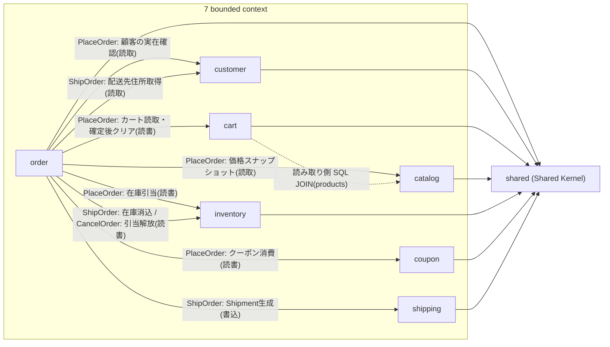

# コンテキストマップ(Context Map)

このリポジトリの `internal/domain` 配下にある **8 パッケージ**(catalog・cart・order・customer・inventory・shipping・coupon の **7 bounded context** + `shared` **1 Shared Kernel**)の関係を、1 枚の図と表にまとめた戦略的設計ドキュメントです。`shared` は bounded context ではなく、複数コンテキストが小さく保つことに合意して共有する Shared Kernel という別概念であることに注意してください([shared-kernel.md](ddd/shared-kernel.md)参照)。

各所の README([bounded-context.md](ddd/bounded-context.md)、`internal/application/README.md`、各コンテキストの README)に散在していた依存関係を、ここに集約しています。詳細な経緯や検証は各リンク先を参照してください。[bounded-context.md](ddd/bounded-context.md)のコンテキスト概観図と矛盾しないように書いていますが、本ドキュメントはユースケース単位でエッジを分解し、関係パターンの分類・ID型対照表・コンテキスト横断一覧を追加した、より詳細な戦略的設計ドキュメントという位置づけです。

## 1. 全体像(コンテキストマップ)

- **実線**: `internal/application/usecase/order` のユースケースが、対象コンテキストの `Repository` インターフェースとドメインパッケージを直接 import して行うオーケストレーション呼び出しです(ドメイン層同士は互いを import しません)。
- **点線**: `cart_query_service.go` が行う、ドメイン層を経由しない読み取り専用の SQL JOIN です。
- `order → inventory` は PlaceOrder(引当)・ShipOrder(消込)・CancelOrder(解放)の 3 ユースケースが同じ辺に重なるため、1 本にまとめています。

## 2. 関係パターンの分類

DDD のコンテキストマッピング語彙([ddd-research.md](ddd-research.md)参照)に照らして、各エッジを正直に分類します。

| エッジ | 発生ユースケース | 関係パターン(語彙上の分類) | 備考 |
|---|---|---|---|
| order → customer / cart / catalog / inventory / coupon | `PlaceOrderUseCase` | **該当なし**(下記参照) | 5 コンテキストへの直接オーケストレーション |
| order → customer / shipping / inventory | `ShipOrderUseCase` | **該当なし**(下記参照) | 3 コンテキストへの直接オーケストレーション |
| order → inventory | `CancelOrderUseCase` | **該当なし**(下記参照) | 引当の解放のみ |
| cart -.-> catalog | クエリサービス(`cart_query_service.go`) | 読み取り側のスキーマ結合(独立した関係パターン名ではなく、CQRS の query 側に限定した実装上の結合) | 書き込み側は型で分離済み。詳細は[cart/README.md](../internal/domain/cart/README.md) |
| 全コンテキスト → shared | — | **Shared Kernel**(Evans) | 「小さく保つ」原則、詳細は[ddd-research.md](ddd-research.md) |

**正直な評価**: order から他コンテキストへの直接呼び出しは、Customer-Supplier・Conformist・Open Host Service・Anticorruption Layer(ACL)のいずれの標準パターンにも当てはまりません。これらは複数チームが別々にモデルを進化させることを前提にした関係ですが、本リポジトリは単一チームが単一デプロイ単位として書いている**モジュラーモノリスの application 層統合**であり、ACL も Published Language も挟まず、ドメインパッケージと `Repository` を直接 import しています。コンテキストの自律性(ドメイン層同士は import しない)は型で守られていますが、それを束ねる application 層自体はどのコンテキストとも自由に結合できる設計であり、これは意図した trade-off です([README.md](../README.md)「直接呼び出しによるコンテキスト間連携」参照)。この 1 トランザクションでの束ね方の評価(Vernon のルールからの逸脱として)は [specs/ddd-improvements.md](specs/ddd-improvements.md) の項目 4 に譲ります。

言い換えると、本リポジトリでは「コンテキストは自律的」という原則を**ドメイン層のコンパイル時境界**として厳格に守る一方、「コンテキスト間の連携には変換層(ACL)や公開言語(Published Language)を挟む」という原則は**採用していません**。これは実装量を抑えて学習コストを下げるための意図的な選択であり、複数チームがそれぞれ別ペースでモデルを進化させる実務環境ではこの trade-off は成立しません。その場合に採るべき選択肢(ドメインイベント + 購読、ACL の導入など)は [ddd-research.md](ddd-research.md) の該当箇所を参照してください。

## 3. ID 型対照表

`ProductID`・`CustomerID`・`OrderID` は、同一の UUID 文字列空間を共有しつつも、コンテキストごとに意図的に型を重複定義しています(コンテキストの自律性を型で守るため)。一覧性のためにここにも掲載しますが、経緯や具体的なコード上の判断コメントは [ubiquitous-language.md](ddd/ubiquitous-language.md) を参照してください。

| ID 型 | 定義箇所(コンテキスト) |
|---|---|
| `ProductID` | [catalog](../internal/domain/catalog/product_id.go) / [cart](../internal/domain/cart/ids.go) / [inventory](../internal/domain/inventory/product_id.go) |
| `CustomerID` | [order](../internal/domain/order/ids.go) / [cart](../internal/domain/cart/ids.go) / [customer](../internal/domain/customer/ids.go) |
| `OrderID` | [order](../internal/domain/order/ids.go) / [shipping](../internal/domain/shipping/ids.go) |

いずれも値としては同一の UUID 文字列を共有しますが、型としては非互換であり、コンテキストをまたいで直接代入するとコンパイルエラーになります(意図的な設計)。

## 4. ユースケース別のコンテキスト横断一覧

`internal/application/usecase/order` の 3 ユースケースが、1 トランザクションでどれだけのコンテキストを読み書きしているかをまとめます。

| ユースケース | 他コンテキスト数(order を除く) | order を含む総数 | 読み書きするコンテキスト |
|---|---|---|---|
| `PlaceOrderUseCase` | 5 | 6 | order(書込) / customer(読取) / cart(読書) / catalog(読取) / inventory(読書) / coupon(読書・任意) |
| `ShipOrderUseCase` | 3 | 4 | order(書込) / customer(読取) / inventory(読書) / shipping(書込) |
| `CancelOrderUseCase` | 1 | 2 | order(書込) / inventory(読書) |

いずれも `tx.Manager` が張る 1 つのトランザクションで完結します。特に `PlaceOrderUseCase` は最大 4 集約種・約 23 インスタンス(Cart + Order + Stock×最大20 + Coupon)を 1 トランザクションで更新しており、Vernon の「1 トランザクションで変更する集約インスタンスは 1 つ」というルールから明確に逸脱しています。この逸脱の妥当性評価(どの "Reason to Break the Rules" に該当するか)は [specs/ddd-improvements.md](specs/ddd-improvements.md) の項目 4 で扱っています。
