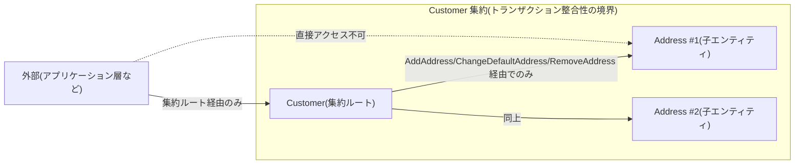
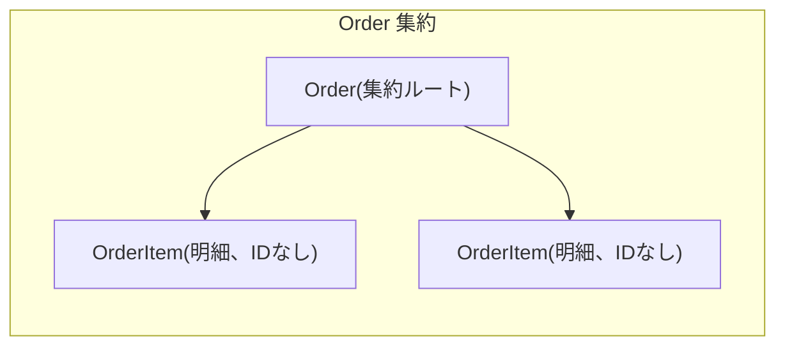

# 集約(Aggregate)

集約とは、整合性(不変条件)を保つ単位としてまとめられたエンティティ・値オブジェクトの集まりです。外部からは集約ルート(Aggregate Root)という唯一の入口を経由してのみ操作でき、内部の子要素を直接書き換える経路は存在しません。1つの集約が1つのトランザクション整合性の境界になります。

## なぜ必要か

不変条件の中には、複数の子要素を横断して見なければ判定できないものがあります。子要素それぞれに検証ロジックを分散させると、この種の不変条件は守れません。集約ルートに操作を集約し、外部からの直接アクセスを塞ぐことで、「集約が保存されている限りいつ読んでも不変条件が破れていない」という保証を作れます。

## 集約境界のイメージ

## このリポジトリでの実例

**Customer + Address**([customer.go](../../internal/domain/customer/customer.go))が本サンプルで最も分かりやすい集約の見本です。「デフォルト住所は、住所が1件でもあれば必ずちょうど1つ存在する」という不変条件は、`Address`単体では守れず、兄弟にあたる他の住所すべての状態を横断的に見る必要があります。そのため`Address`は([address.go](../../internal/domain/customer/address.go))非公開フィールドのみを持ち、生成・変更は`Customer.AddAddress` / `ChangeDefaultAddress` / `RemoveAddress`を経由してのみ行えます。

**Order + OrderItem**([order.go](../../internal/domain/order/order.go))は「明細が1件もない注文は存在しない」という不変条件を`NewOrder`が守り、状態遷移(`Pay`/`Ship`/`Cancel`)も集約ルートのメソッドに閉じています。

**Cart**([cart.go](../../internal/domain/cart/cart.go))は数量上限(`maxQuantityPerItem = 99`)と明細数上限(`maxDistinctItems = 20`)という不変条件を`AddItem`の中で守ります。

## 1トランザクション=1集約というルールと、本リポジトリの意図的な逸脱

Vernon の *Effective Aggregate Design* は「1トランザクションで変更する集約インスタンスは1つ」を目標とする一方、正当な理由があれば経験者の判断で逸脱してよいとしています(詳細は[ddd-research.md](../ddd-research.md)の逐語引用を参照)。本リポジトリの`PlaceOrderUseCase`([place_order.go](../../internal/application/usecase/order/place_order.go))は、1トランザクションでCart・Order・Stock(最大20件)・Couponという最大4集約種・約23インスタンスを更新しており、このルールを意図的に破っています。この逸脱の妥当性とコストについては[specs/ddd-improvements.md](../specs/ddd-improvements.md)の項目4を参照してください。

## 注意点・よくある誤解

- 「1集約=1テーブル」ではありません。`Order`は`orders`と`order_items`の2テーブルにまたがって永続化されます。
- 集約が大きいほど良いわけではなく、むしろ小さく設計するのがVernonのルール2です。本サンプルではほとんどの集約が1〜2種類のエンティティで構成されています。
