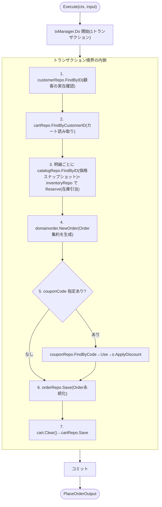

# アプリケーションサービス(このリポジトリでは usecase)

アプリケーションサービスとは、ユーザーの操作単位に対応する処理を「調整(オーケストレーション)」する層です。ビジネスルールの判断は一切持たず、集約を読み込み・集約のメソッドを呼び・保存する、という手順の組み立てに徹します。本リポジトリでは`internal/application/usecase`配下に置かれ、1ファイル=1ユースケースという構成を取ります。

## なぜ必要か

コントローラ(presentation層)がドメイン層を直接操作すると、トランザクション境界や複数リポジトリの呼び出し順序といった「業務操作の手順」がプレゼンテーション層に漏れ出します。逆にこの手順をドメイン層(集約)に持たせると、集約が本来の関心事(不変条件)を超えて肥大化します。アプリケーションサービスはこの中間に立ち、Three Dots Labsが述べる通り"We also have no logic here: just some orchestration."(逐語引用は[ddd-research.md](../ddd-research.md)参照)という役割に徹します。

## PlaceOrderUseCase のオーケストレーション

## このリポジトリでの実例

**[place_order.go](../../internal/application/usecase/order/place_order.go)** (`PlaceOrderUseCase`)は複数コンテキストの調整を行う最も複雑な例です。顧客の実在確認(customer)→カートの読み取り(cart)→商品価格のスナップショット取得(catalog)→在庫引当(inventory)→クーポン適用(coupon)→Order保存→カートのクリア、という手順を`txManager.Do`の1トランザクションの中で組み立てます。各ステップの妥当性判断(在庫が足りるか、クーポンが有効か等)はすべて呼び出し先の集約のメソッドが返し、ユースケース自身はその結果をそのまま伝播させるだけです。

**[add_item.go](../../internal/application/usecase/cart/add_item.go)** (`AddItemUseCase`)はfind-or-createパターンの例です。カートが存在しなければ`shared.ErrNotFound`を正常系の分岐として扱い、`domaincart.NewCart`で新規生成してから`AddItem`を呼びます。

## トランザクション境界の所有

1回のユースケース実行は原則1つのトランザクションに対応し、`tx.Manager`インターフェース([manager.go](../../internal/application/tx/manager.go))を介して表現します。ユースケースは`tx.Manager`というインターフェースにのみ依存し、実装がGORMのトランザクションであることを知りません。トランザクションを開始・コミットするかどうかを決めるのは常にアプリケーション層であり、リポジトリ自身が独自にトランザクションを張ることはありません(詳細は[repository.md](repository.md)を参照)。

## 注意点・よくある誤解

- `PlaceOrderUseCase`は5コンテキストのドメインパッケージをimportします(命名規則として`domaincart`のような接頭辞で衝突を避けています)。この規模の依存は集約設計上の逸脱でもあり、[aggregate.md](aggregate.md)と[specs/ddd-improvements.md](../specs/ddd-improvements.md)の項目4を参照してください。
