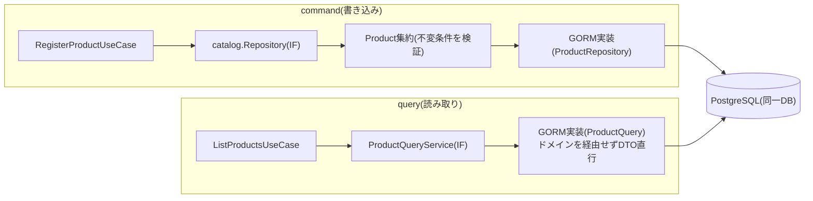

# CQRS(コマンドクエリ責務分離、軽量版)

CQRS(Command Query Responsibility Segregation)とは、状態を変更する操作(コマンド)と状態を読み取るだけの操作(クエリ)でモデルを分離するパターンです。Fowlerは有用性を認めつつ、"beware that for most systems CQRS adds risky complexity."「多くのシステムでは危険な複雑さを追加する」と強く注意を促しています(逐語引用は[ddd-research.md](../ddd-research.md)参照)。

## このリポジトリでの非対称性

本リポジトリはコマンドとクエリで別々のデータストア・別々のパッケージ階層を持つ本格的なCQRSではなく、「ドメインを経由するかどうか」だけを非対称にした軽量版です。

- **command(書き込み)**: 必ずドメイン層を経由します。リポジトリ(ドメイン層のポート)から集約を読み込み、集約のメソッドを呼んで不変条件を守った状態変更を行い、リポジトリで保存します。
- **query(読み取り)**: ドメイン層を迂回し、クエリサービス(application層でインターフェース定義・infrastructure層でGORM実装)がDBの行から直接DTOを組み立てます。

## commandとqueryの非対称な経路

## このリポジトリでの実例

**[list_products.go](../../internal/application/usecase/catalog/list_products.go)**の`Execute`は`return uc.queryService.List(ctx)`という1行の委譲だけで完結しています。ドメインの`Product`集約を経由しません。

**[query_service.go](../../internal/application/usecase/catalog/query_service.go)**が`ProductQueryService`インターフェースを宣言し、そのコメントが理由を明記しています。「一覧表示のような『ただ表示するだけ』の処理でドメイン集約を都度組み立てるのはオーバーヘッドであり、集約が持つ業務ルールも読み取りには不要である」。実装は[catalog_query_service.go](../../internal/infrastructure/persistence/catalog_query_service.go)の`ProductQuery`が担い、`db.Find(&models)`でGORMモデルを取得後、`toProductDTO`で直接DTOに変換します(バリデーションを伴わない単純なコピーです)。

## 分離は論理レベルのみ

command用のリポジトリとquery用のクエリサービスは同一のPostgreSQLデータベース・同一のテーブルを参照します。書き込み用DBと読み取り用DBを物理的に分離する、あるいは非同期でレプリケートするような本格的なCQRSではありません。分離はあくまで「コード上、ドメインモデルを経由するかどうか」という論理レベルに留まります。

## 注意点・よくある誤解

- Fowlerは「システム全体ではなく特定の bounded context に限って適用すべき」とも述べています。本リポジトリはこの助言通り、全コンテキストで一律にコマンドとクエリを別パッケージへ分割するような重い構成は取っていません(ファイル名と依存の形で区別する方針、詳細は[application-service.md](application-service.md))。
- コンテキスト横断のJOIN(catalogのカラムをcartのクエリで直接参照する等)を読み取り側で行うことの明示的な可否を述べた一次ソースはなく、これは「迂回の許容」からの推定適用です(詳細は[ddd-research.md](../ddd-research.md))。実例と注意点は[bounded-context.md](bounded-context.md)を参照してください。
