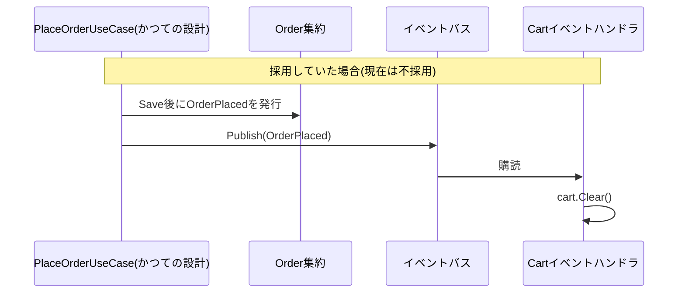
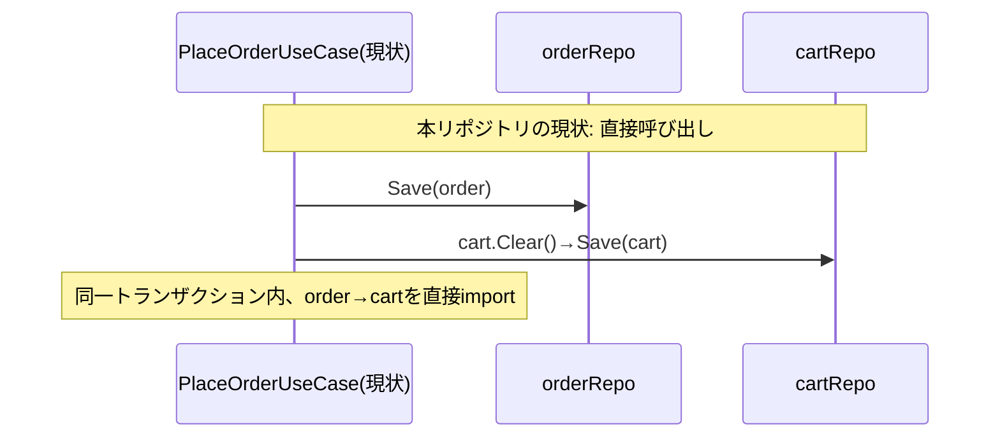

# ドメインイベント(Domain Event)

ドメインイベントとは、「ドメインの中で何かが起きた」という事実を表すオブジェクトです(例: 「注文が確定した」)。イベントを発行し、他のコンテキストや購読者がそれを受け取って反応することで、発行側は購読側の存在を知らないまま連携できます。Fowlerは監査証跡やイベントソーシングへの応用を認めつつ、独特のアーキテクチャスタイルを持ち込むため「労力対効果を検討すべきトレードオフ」だと位置づけています(逐語引用は[ddd-research.md](../ddd-research.md)参照)。

## なぜ必要か

複数のコンテキストが同じ操作(例: 注文確定)に反応する必要が出てきたとき、呼び出し側(order)が反応する側(cart、point、notificationなど)をすべて直接importして呼び出す設計にすると、反応するコンテキストが増えるたびに呼び出し側の依存が増え続けます。イベント+購読による疎結合化は、この結合の増殖を防ぐ手段です。

## 採用時の姿 vs 本リポジトリの現状

## 本リポジトリでは採用していません

現在の`PlaceOrderUseCase`([place_order.go](../../internal/application/usecase/order/place_order.go))は、注文確定後にカートを空にする処理を`uc.cartRepo.Save`への直接呼び出しで行っています。コード中のコメントに経緯が明記されています。

> 以前はここでドメインイベント(OrderPlaced)を発行し、カート側のハンドラが購読して空にする方式だったが、仕組みの理解コストを下げるため直接呼び出しに変更した。application 層での直接呼び出しはorder→cartの依存を生む(結合度は上がる)一方、処理の流れが一目で追える。

つまり、かつて`OrderPlaced`イベント+同期イベントバスで実装されていたものを、学習コストを下げるために意図的に取り下げた経緯があります。[internal/infrastructure/README.md](../../internal/infrastructure/README.md)にも「そのためinfrastructure層にイベントバスの実装は存在しない」と明記されています。

## 発展形への言及

反応するコンテキストが増えてきたら(例: 注文確定時にポイント付与も行いたい等)、ドメインイベント+購読による疎結合な連携へ発展させるのが定石です。同期のインメモリイベントバスに加え、集約の保存と同一トランザクションでOutboxテーブルへ書き込み、別プロセスがKafka/SQS等へ非同期に発行するOutboxパターンも、結果整合性を前提とした発展形として挙げられます。

## 注意点・よくある誤解

- 「ドメインイベント不採用・直接呼び出し」は本リポジトリが意図して選んだトレードオフであり、欠陥ではありません([specs/ddd-improvements.md](../specs/ddd-improvements.md)前提を参照)。
- モジュラーモノリスの代表的参照実装([kgrzybek/modular-monolith-with-ddd](https://github.com/kgrzybek/modular-monolith-with-ddd))は逆に同期呼び出しを一切禁止し、イベント限定という立場を取ります。どちらが「正解」かは一次ソースでも係争中の論点です(詳細は[ddd-research.md](../ddd-research.md))。
