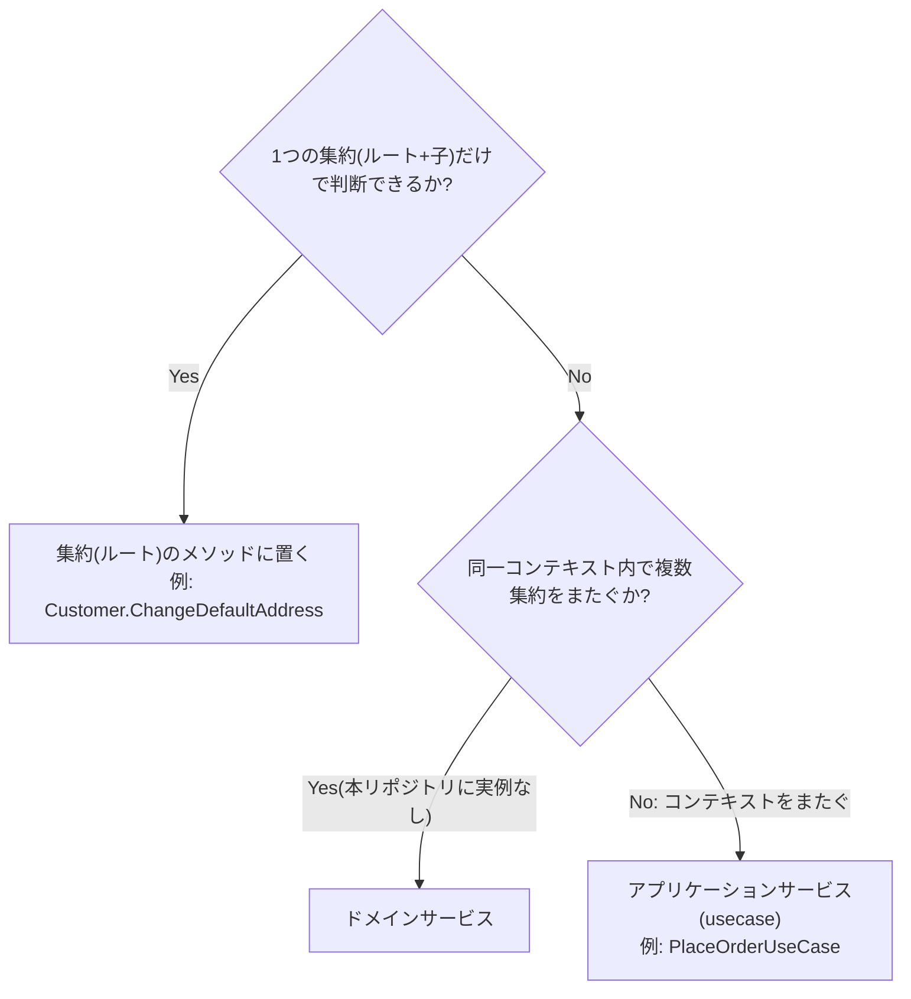

# ドメインサービス(Domain Service)

ドメインサービスとは、単一のエンティティ・値オブジェクトには自然に置けないビジネスロジック(典型的には、同一コンテキスト内で複数の集約をまたぐ計算や判断)を置くためのドメイン層のオブジェクトです。集約のメソッドでもリポジトリでもない、第三の置き場所という位置づけになります。

## なぜ必要か

ロジックの置き場所に困ったからといって何でもアプリケーション層に置いてしまうと、本来ドメインのルールであるはずのロジックがオーケストレーション層に漏れ出し、テストや再利用が難しくなります。「どの集約にも属さないが、明確にドメインのルールである」ロジックの受け皿として、ドメインサービスという型を用意しておくのがDDDの定石です。

## ロジックの置き場所判定

## 本リポジトリでは未使用です

`internal/domain`配下のいずれのコンテキストにもドメインサービスの実装は存在しません。理由は、本リポジトリの各コンテキスト(catalog / cart / order / customer / inventory / shipping / coupon)がそれぞれ集約を1つずつしか持たず、コンテキスト内で複数の集約をまたぐロジックが構造的に発生しないためです。

コンテキストを横断する調整(顧客の実在確認、在庫の引当、クーポンの適用など)は確かに存在しますが、それらはドメインサービスではなくアプリケーション層(usecase)の責務として実装されています。例えば`PlaceOrderUseCase`([place_order.go](../../internal/application/usecase/order/place_order.go))が顧客・カート・カタログ・在庫・クーポンという複数コンテキストを調整していますが、これは「同一コンテキスト内の複数集約をまたぐ計算」ではなく「複数コンテキストのオーケストレーション」であり、性質が異なります。この整理の詳細は[application-service.md](application-service.md)と[bounded-context.md](bounded-context.md)を参照してください。

## 注意点・よくある誤解

- ドメインサービスの不在は実装漏れではなく、「必要になる場面が現状のコードにない」という監査結果です。かつて`internal/domain/README.md`はドメインサービスを「この層に置くもの」として一般論的に列挙していましたが、実例ゼロという実態と揃えて記述を修正すべき対象として[specs/ddd-improvements.md](../specs/ddd-improvements.md)の項目10に挙がっています。
- 将来、同一コンテキスト内に2つ目の集約が追加され、両者にまたがる計算(例: 在庫コンテキストに「複数商品の引当優先順位を決める」ロジックが必要になる等)が生まれたら、その時点でドメインサービスの導入を検討するのが自然な流れです。
