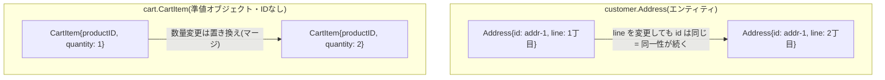

# エンティティ(Entity)

エンティティとは、値ではなく識別子(ID)によって同一性が決まるオブジェクトです。フィールドの値が全く同じでも、IDが違えば別物として扱われ、逆にIDが同じであれば属性が変化しても「同じもの」として扱われます。

## なぜ必要か

「同じ商品を2回注文したら同一注文として扱ってよいか」のような問いに答えるには、値の一致ではなく識別子で同一性を判定する型が必要です。集約ルートだけでなく、集約内部の子要素にも独自の識別子を持たせたい場面があり、それが「集約内部のエンティティ」です。

## 識別子の有無による違い

## このリポジトリでの実例

**customer.Address**([address.go](../../internal/domain/customer/address.go))は独自の識別子`AddressID`を持つ、`Customer`集約に属する子エンティティです。同じ郵便番号・住所であっても`AddressID`が異なれば別の住所として扱われます。フィールドはすべて非公開で、生成・変更は`Customer`のメソッド経由のみです。

対照的に、**CartItem**([cart_item.go](../../internal/domain/cart/cart_item.go))と**OrderItem**([order_item.go](../../internal/domain/order/order_item.go))は独自のIDを持ちません。`CartItem`は`ProductID`(参照先商品のID)と数量だけを持つ「値の集まり」で、コード中のコメントでも「集約内部のエンティティ」と説明されていますが、識別に使えるのは実質的に`ProductID`(=商品への参照)であり、独立した識別子を発行していません。`OrderItem`も同様に、注文明細それぞれを識別するIDを持たず、`Order`が保持するスライスの一要素として扱われます。両者とも生成・変更を集約ルート経由に限定する設計(フィールド非公開)は共通していますが、「独自の識別子を持つかどうか」という点で`Address`とは性質が異なります。

## 注意点・よくある誤解

- エンティティ=集約ルートではありません。集約ルートは「エンティティのうち、外部からの入口になるもの」という特殊な役割です。`Address`はエンティティですが集約ルートではありません。
- IDの有無だけでエンティティか値オブジェクトかを機械的に判定できるとは限りません。`CartItem`/`OrderItem`のように「識別子は持たないが挙動としては集約ルート経由の制御を受ける」中間的な設計も実務ではよく見られます。値オブジェクトとの違いは[value-object.md](value-object.md)を参照してください。
