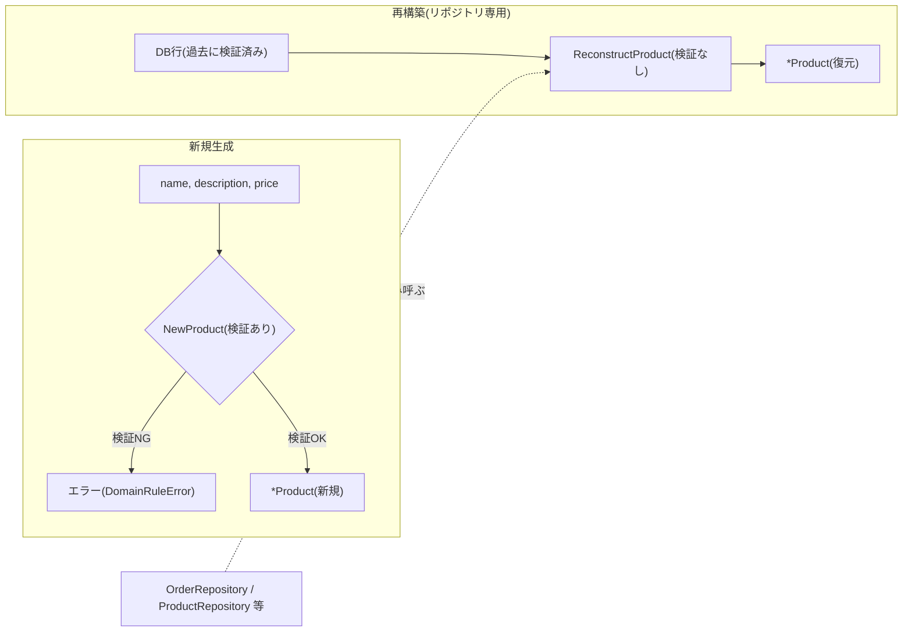

# ファクトリ(生成と再構築の分離)

ファクトリとは、集約やエンティティを正しい初期状態で生成する責務を持つ仕組みです。本リポジトリでは専用のFactory型は置かず、「新規生成」と「永続化層からの再構築」を別々のコンストラクタ関数に分離するという軽量なパターンで実現しています。

## なぜ必要か

「これから新しく生まれるデータ」と「すでにDBに存在し、過去に検証済みのデータを読み戻すだけ」は、検証すべき責務がまったく異なります。同じコンストラクタで両方を扱おうとすると、次のような問題が起きます。

- 新規生成用の検証を再構築時にも強制すると、将来ルールを厳しく変更したときに過去データが読み込めなくなる。
- 逆に検証を省いたコンストラクタを新規生成にも使えてしまうと、不正な状態の集約が誤って作れてしまう。

## 生成経路と再構築経路

## このリポジトリでの実例

この`New*`(検証あり) / `Reconstruct*`(検証なし・リポジトリ専用)というペアは、確認できたすべての集約・エンティティで一貫しています。

| 集約/エンティティ | 生成 | 再構築 |
|---|---|---|
| Product | [`NewProduct`](../../internal/domain/catalog/product.go) | `ReconstructProduct` |
| Cart / CartItem | [`NewCart`](../../internal/domain/cart/cart.go) | `ReconstructCart` / `ReconstructCartItem` |
| Order / OrderItem | [`NewOrder`](../../internal/domain/order/order.go) | `ReconstructOrder`([order_item.go](../../internal/domain/order/order_item.go)の`ReconstructOrderItem`) |
| Customer / Address | [`NewCustomer`](../../internal/domain/customer/customer.go) | `ReconstructCustomer`([address.go](../../internal/domain/customer/address.go)の`ReconstructAddress`) |
| Coupon | [`NewAmountCoupon`/`NewRateCoupon`](../../internal/domain/coupon/coupon.go) | `ReconstructCoupon` |

`ReconstructProduct`のコメントが理由を端的に述べています。「DBから読み出す値は過去にNewProductのバリデーションを通過して保存されたものであり、再度同じチェックを課す必要はない(むしろ将来バリデーションルールを厳しく変更した場合に、過去のデータが読み込めなくなるという事故を防げる)」。`Reconstruct*`系はすべてリポジトリ実装(infrastructure層)からのみ呼ばれる想定です。

## 注意点・よくある誤解

- `Reconstruct*`は「検証を怠っている」のではなく「過去に検証済みという前提に立って再検証を省いている」設計判断です。DBの中身を直接改変するなど前提を破る操作をすると、この保証は崩れます。
- 独立したFactoryインターフェースやFactoryパターンのクラスは本リポジトリには存在しません。Go では関数ベースの`New*`/`Reconstruct*`で十分という判断です。
