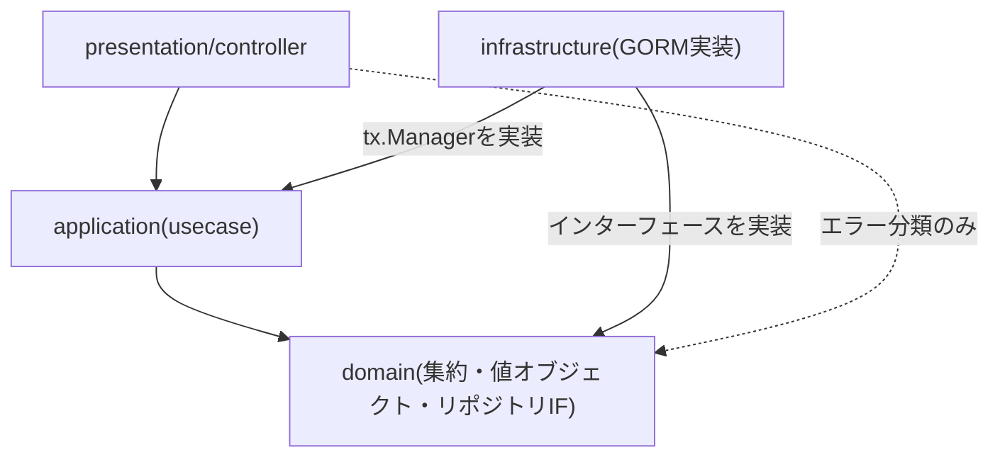

# オニオンアーキテクチャと依存性逆転

オニオンアーキテクチャとは、システムを同心円状の層に分け、依存の向きをつねに外側から内側(ドメイン)へ強制するアーキテクチャスタイルです。ドメイン層が最も内側にあり、何にも依存しません。

## 4層と依存方向

依存はつねに外側(presentation/infrastructure)から内側(domain)へ向かいます。domainはどの層にも依存しません。

本リポジトリは`domain` / `application` / `infrastructure` / `presentation`の4層で構成されます。

- **domain**([internal/domain](../../internal/domain)) — 集約・値オブジェクト・リポジトリIF。何にも依存しない最内層。
- **application**([internal/application](../../internal/application)) — ユースケース。domainに依存する。
- **infrastructure**([internal/infrastructure](../../internal/infrastructure)) — GORM実装。application・domainに依存し、リポジトリIFと`tx.Manager`を実装する。
- **presentation**([internal/presentation](../../internal/presentation)) — HTTPコントローラ。主にapplicationに依存する。

infrastructureがdomainに依存する(リポジトリIFを実装する)方向であって、その逆ではない点がオニオンアーキテクチャの核心です。これにより「DBをPostgreSQLから別の実装に差し替える」といった技術的決定を、ビジネスルールに一切手を入れずに行えます。詳細な依存関係図は[../execution-flow.md](../execution-flow.md)の「層の依存関係」の節にmermaid図があります。

## 「依存の向き」と「実行時の呼び出し順」は別物

依存の矢印(コンパイル時にどのパッケージをimportするか)と、実行時にどの順で処理が呼ばれるかは一致しません。例えばcommand実行時、実際の呼び出し順は`presentation → application → domain`のあと`application → infrastructure(リポジトリ実装)`という順に進みますが、依存の向きとしては`infrastructure → domain`(リポジトリ実装がインターフェースを実装する)であり、domainはinfrastructureの存在を知りません。この非対称性が「なぜinfrastructureが外側の層なのに実行時にはdomainの後で動くのか」を混乱させやすいポイントです。実際の呼び出し順序をシーケンス図で追いたい場合は[../execution-flow.md](../execution-flow.md)の「commandの実行順序」「queryの実行順序」の節を参照してください。

## composition root

依存関係の実際の組み立て(誰が誰を注入するか)は、`cmd/api`という1箇所(composition root)に集約されています。[wire.go](../../cmd/api/wire.go)が「どのプロバイダをどう組み合わせるか」という設計図で、`wireinject`ビルドタグにより通常のビルドには含まれません。ここから`github.com/almondoo/wire`(コンパイル時DIコード生成ツール)が`wire_gen.go`を生成し、`main.go`は生成された`initializeServer(dsn)`を呼ぶだけです。手書きDIやリフレクションベースのDIコンテナと異なり、配線の不整合はwireの生成時点でコンパイルエラーとして検出できます。

## 注意点・よくある誤解

- presentation層は例外的に`domain/shared`のエラー種別(`shared.ErrNotFound` / `shared.IsDomainRuleError`)だけを直接参照します。これはエラーをHTTPステータスへ分類するためであり、外側の層が内側の層を参照すること自体はオニオンアーキテクチャのルール違反ではありません(禁止されるのは内側から外側への依存です)。
- 「4層」という区切りはこのリポジトリの構成であり、DDDそのものが4層構成を要求しているわけではありません。ヘキサゴナルアーキテクチャやクリーンアーキテクチャも同じ依存性のルールを別の層名で表現したものです。
