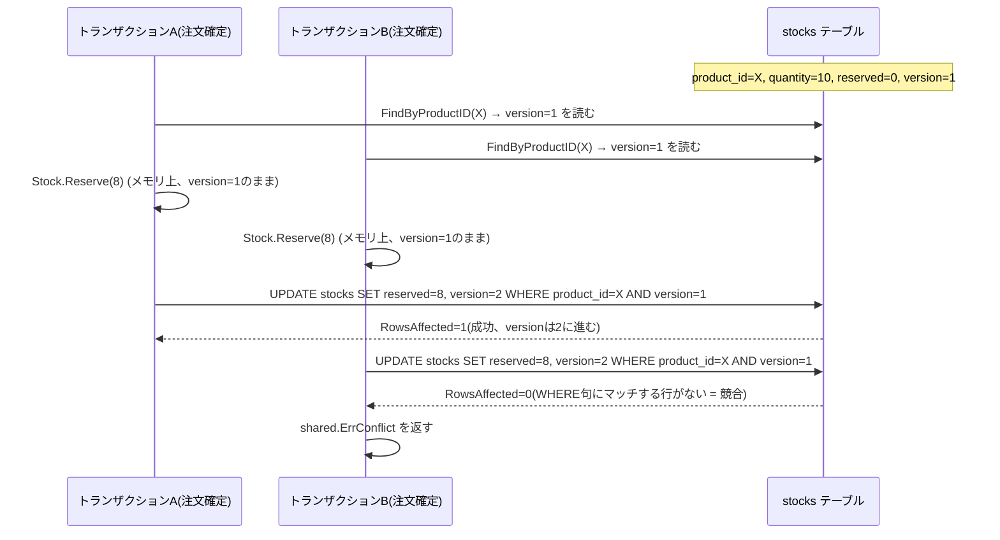

# 楽観ロック(Optimistic Lock)

楽観ロックとは、集約に版数(version)を持たせ、保存時に「読み込んだ時点の版数と現在DB上の版数が一致するか」を条件付き更新(`UPDATE ... WHERE version = ?`)で検証する競合検出の仕組みです。行レベルのロックを保持し続ける悲観ロック(`SELECT ... FOR UPDATE`)とは異なり、読み込みから保存までの間は誰もロックを取らず、保存の瞬間だけ「競合していないか」を確認します。

## なぜ必要か

集約は不変条件を守る境界ですが、それが保証できるのは「1つの集約インスタンスに対する1回の操作」の整合性までです。Vernon は集約設計のルール1として次のように述べています(逐語引用は[ddd-research.md](../ddd-research.md)参照)。

> "And a properly designed bounded context modifies only one aggregate instance per transaction in all cases." (Part I, p.4)

これは「1トランザクションが触れる集約は1つにせよ」という指針ですが、裏を返せば「1つの集約であっても、複数のトランザクションが同時にそれを読み書きする」ケースまでは面倒を見てくれません。同じ集約を2つのトランザクションがほぼ同時に読み込み、それぞれが自分の読み込んだ内容をもとに更新すると、後から書き込んだ方が先の更新を上書きしてしまう「lost update(更新の消失)」が発生します。集約のメソッド内でどれだけ不変条件チェックを厳密に書いても、そのチェックは「メモリ上の1インスタンス」に対してしか行われないため、この種の競合は防げません。楽観ロックは、この「読んでから書くまでの間に他のトランザクションが割り込んでいないか」を永続化層で検出する手段です。

## 競合検出の流れ

TxBのUPDATEが失敗するのは、TxAの更新によってDB上のversionがすでに2になっており、TxBが発行した`WHERE version = 1`という条件にマッチする行が0件になるためです。実在庫が10しかないのに2つの注文が8個ずつ引き当ててしまう(合計16個、実在庫を超過する)lost updateを、この仕組みが防ぎます。

## このリポジトリでの実例

`inventory.Stock`([stock.go](../../internal/domain/inventory/stock.go))が非公開の`version int`フィールドを持ちます。`NewStock`は新規集約の版数を0(「まだ一度も永続化されていない」ことを表す規約。実際に`version=1`が採番されるのはリポジトリの`Save`が`INSERT`を行った時点)から始め、`ReconstructStock`は永続化層から読み込んだ版数(常に1以上)をそのまま引数で受け取ります。`Version()`アクセサがこの値をリポジトリ実装に公開します。

version をドメインモデル(`Stock`)自身に持たせているのは、「この集約が読み込まれた時点の版数」を業務ロジックと一体で扱い、集約の整合性境界をアプリケーション層やインフラ層に漏らさないためです。version が単なるDBカラムの値としてリポジトリ層にしか存在しないと、「今扱っている `Stock` インスタンスがどの版数を前提にしているか」をアプリケーション層が別途管理する必要が生まれ、集約が整合性の境界であるという原則が崩れます。

永続化層は`StockRepository.Save`([inventory_repository.go](../../internal/infrastructure/persistence/inventory_repository.go))が担います。以前の実装は「`product_id`のCOUNTで存在確認してからINSERT/UPDATEを分岐する」find-then-branch方式でしたが、これは存在確認から実際の書き込みまでの間に他のトランザクションが割り込むTOCTOU(Time-Of-Check-Time-Of-Use)競合を引き起こしていました(存在確認後に別のトランザクションが先にINSERTしてしまうと、後発側の存在確認は「存在する」と誤判定してUPDATE分岐に進み、`NewStock`も`version=1`から始まる旧実装だったため`WHERE version = 1`が偶然マッチして先発側の書き込みを黙って上書きしてしまう、というlost updateが実際に確認されています)。

これを避けるため、現在の実装はDBへの問い合わせを挟まず、集約自身が持つ`version`の値だけでINSERT/UPDATEを判定します。`version == 0`(未永続化)なら`version = 1`で`INSERT`し、`version >= 1`(永続化済み)なら`UPDATE ... WHERE product_id = ? AND version = ?`という条件付き更新で`version`を+1します。`RowsAffected == 0`は「行が存在しない」か「versionが不一致(他のトランザクションが先に更新した)」のいずれかですが、両者を厳密に区別する必要はなく、一律で`shared.ErrConflict`をラップして返します(呼び出し側にとって重要なのは「読み込み時点から状態が変わっている」という事実だけであるため)。INSERT分岐でも、同じ`product_id`に対する同時INSERTは主キーの一意制約違反になるため、`gorm.ErrDuplicatedKey`を`errors.Is`で検出して同様に`shared.ErrConflict`にマッピングします(ドライバ固有エラーをGORMの共通センチネルエラーへ変換する`gorm.Config{TranslateError: true}`が前提)。`StockModel`([inventory_model.go](../../internal/infrastructure/persistence/inventory_model.go))の`Version int`カラムは`gorm:"not null;default:1"`で定義されており、既存の GORM AutoMigrate によってスキーマに反映されます(マイグレーションファイルの追加は不要)。

## なぜ Stock だけに実装したか

本リポジトリは「1パターン=1つの代表例」という学習コスト優先の方針を取っており(全集約に同じ仕組みを網羅的に適用するのではなく、パターンが最も分かりやすく現れる箇所に絞って実装します)、楽観ロックは`Stock`だけに実装しています。`Stock.Reserve`は「同じ商品を複数の注文が同時に引き当てる」という lost update が最も起きやすく、かつ実害(在庫超過)が分かりやすい箇所だからです。

`coupon.Coupon`の利用回数上限のように、同種の並行更新リスクを抱える集約は他にも存在します([internal/application/README.md](../../internal/application/README.md)の「並行時のロストアップデート」節を参照)。これらに同じ仕組みを広げる場合は、`Stock`と同じ手順を踏めば拡張できます。

1. 対象の集約に`version int`フィールドと`Version()`アクセサを追加し、`New*`は`version: 0`(未永続化)、`Reconstruct*`は`version`(常に1以上)を引数で受け取るようにする。
2. 対象の永続化モデルに`Version int`カラム(`gorm:"not null;default:1"`)を追加する。
3. リポジトリの`Save`を、DBへの存在確認を挟まず集約自身の`version`だけで分岐する形に書き換える。「`version == 0`なら`version=1`でINSERT(一意制約違反は`gorm.ErrDuplicatedKey`を検出して`shared.ErrConflict`に変換)、`version >= 1`なら`WHERE <主キー> = ? AND version = ?`の条件付きUPDATEで`version+1`(`RowsAffected == 0`を`shared.ErrConflict`にマッピング)」という形にする。存在確認を挟むfind-then-branch方式はTOCTOU競合を招くため避ける(詳細は前節)。

## ErrConflict から HTTP 409 へのマッピング

`shared.ErrConflict`([errors.go:19-31](../../internal/domain/shared/errors.go))は`shared.ErrNotFound`と同じセンチネルエラーの設計に倣っており、リポジトリ実装は`%w`でラップして返します(例: `fmt.Errorf("stock update conflict: product_id=%s: %w", model.ProductID, shared.ErrConflict)`)。呼び出し側は`errors.Is(err, shared.ErrConflict)`で判定できます。

プレゼンテーション層の`WriteError`([response.go:43-59](../../internal/presentation/controller/response.go))は、この`ErrConflict`をHTTP 409 Conflictに変換します(`ErrNotFound`→404、`DomainRuleError`→422、それ以外→500というマッピングの一部)。409を選んでいるのは、楽観ロック競合が「クライアントが最新状態を読み直してリトライすれば解消しうる」という性質を持つ、クライアント側の問題として扱うべきエラーだからです(サーバー内部の問題を表す500とは区別します)。ただし本リポジトリのユースケース層は、この409が返ってきた際の自動リトライ(再読み込みしてから`Reserve`をやり直す)までは実装していません。リトライは呼び出し元(クライアントまたは将来のユースケース層)の責務として残されています。

## 注意点・よくある誤解

- 楽観ロックは「競合を起こさない」仕組みではなく「競合を検出する」仕組みです。競合したトランザクションは失敗し、呼び出し側が読み直して再試行する必要があります。本リポジトリはこの再試行ループを実装しておらず、409を返すところまでが責務です。
- `RowsAffected == 0`を「行が存在しない場合」と「versionが不一致な場合」に分けて`ErrNotFound`と`ErrConflict`を出し分けることもできますが、本リポジトリはあえて分けていません。呼び出し側にとってはどちらも「読み込み直しが必要」という結論は同じであり、区別するための追加クエリ(存在確認)を払うだけの価値がないと判断したためです。
- 悲観ロック(`SELECT ... FOR UPDATE`)は読み込み時点からロックを保持するため lost update をより確実に防げますが、ロック保持時間が長くなるほどスループットが落ちます。本リポジトリは書き込みが集中しにくい学習用サンプルという前提のもと、楽観ロックを選んでいます。
