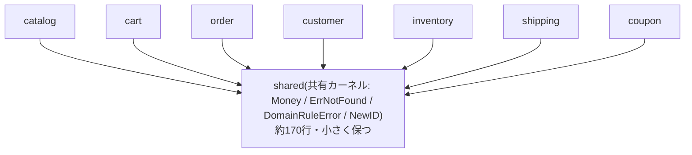

# 共有カーネル(Shared Kernel)

共有カーネルとは、複数のチーム(本リポジトリでは複数のコンテキスト)が明示的な合意のもとで共有する、ドメインモデルの部分集合です。Evansの原典は次のように述べ、共有カーネルを小さく保つことを強く求めています(逐語引用、[ddd-research.md](../ddd-research.md)参照)。

> "Designate with an explicit boundary some subset of the domain model that the teams agree to share. **Keep this kernel small.** ... This explicitly shared stuff has special status, and shouldn't be changed without consultation with the other team."

## なぜ必要か

各コンテキストの自律性を守るという原則([bounded-context.md](bounded-context.md)参照)を厳格に適用すると、`Money`のような本当にどのコンテキストでも同じ意味を持つ概念まで毎回別々に定義することになり、無駄な重複と表記ゆれを生みます。共有カーネルは「本当に安定していて、全コンテキストで同じ意味を持つ」概念に限って例外的に共有を許す仕組みです。ただし合意なしに変更されると全コンテキストに影響が及ぶため、小さく保つことが原則になります。

## 共有カーネルの位置づけ

全コンテキストがshared側を参照しますが、逆方向(sharedが特定コンテキストに依存する)矢印は存在しません。

## このリポジトリでの実例

`internal/domain/shared`がこれにあたります。中身は以下の3ファイルのみで、合計しても200行に満たない規模です。

- [money.go](../../internal/domain/shared/money.go) — `Money`値オブジェクト(負値・通貨不一致を拒否)
- [errors.go](../../internal/domain/shared/errors.go) — `ErrNotFound` / `NewDomainRuleError`などの共通エラー種別
- [id.go](../../internal/domain/shared/id.go) — `NewID`(UUID生成のラッパー)

[internal/domain/README.md](../../internal/domain/README.md)も「共有カーネルは便利だが濫用すると各コンテキストの独立性を損なうため、『本当にどのコンテキストでも同じ意味を持つ、安定した概念』だけを置くべきである」と明記しており、実際にこの3ファイルの範囲を超えて肥大化していません。

## 注意点・よくある誤解

- 共有カーネルに置くべきかどうか迷う概念(例: 特定コンテキストだけが使う値オブジェクト)は、コンテキストごとの重複を許容してでも`shared`に入れないのが本リポジトリの一貫した判断です。`CouponCode`や各種ID型が各コンテキストのパッケージ内に留まっているのはこのためです。
- 「共有カーネル」は「境界づけられたコンテキスト」の一種ではなく、複数のコンテキストにまたがって明示的に共有される別枠の概念です。数え方の注意点は[bounded-context.md](bounded-context.md)を参照してください。
