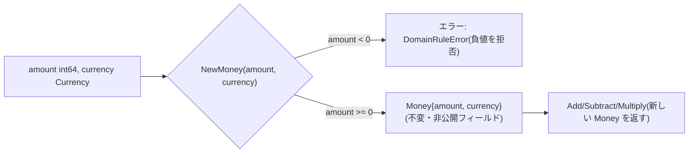

# 値オブジェクト(Value Object)

値オブジェクトとは、識別子を持たず、保持する値そのもので同一性が決まる不変(immutable)なオブジェクトです。一度生成したら状態を書き換えず、変更が必要な操作は常に新しいインスタンスを返します。

## なぜ必要か

`int64`や`string`の生値をドメインのあちこちに流すと、単位や形式の検証がコード全体に散らばり(primitive obsession)、チェック漏れの温床になります。値そのものに検証ロジックとふるまいを閉じ込めれば、「その型のインスタンスとして存在する」こと自体が「妥当な値である」ことの保証になります。

## NewMoney という唯一の関門

## このリポジトリでの実例

**shared.Money**([money.go](../../internal/domain/shared/money.go))が代表例です。`NewMoney`は負の金額を拒否し、`Add`/`Subtract`は通貨単位が異なる同士の演算をドメインルール違反として拒否します。フィールドは非公開で、`Add`/`Subtract`/`Multiply`はすべて新しい`Money`を返し、レシーバ自身は書き換えません。

**coupon.CouponCode**([coupon_code.go](../../internal/domain/coupon/coupon_code.go))は「4〜20文字の大文字英数字とハイフンのみ」という形式ルールを正規表現でコンストラクタに閉じ込めており、一度`CouponCode`型として生成できればそれ以降の呼び出し側は形式の再検証を意識せずに済みます。

**各種ID型**(例: [order/ids.go](../../internal/domain/order/ids.go)、[cart/ids.go](../../internal/domain/cart/ids.go))も値オブジェクトです。`type CustomerID string`のようにstringをラップし、空文字列の生成を拒否するコンストラクタを持たせることで、`OrderID`と`CustomerID`を取り違えてもコンパイルエラーで検出できます。

## 注意点・よくある誤解

- 値オブジェクトは「不変であること」が本質です。`Money`にsetterがないのは手抜きではなく、値オブジェクトである以上そう設計するのが正しいという意図です。
- 同じ文字列(UUID)を保持していても、コンテキストが違えば型としては別物として扱います(例: `cart.ProductID`と`catalog.ProductID`)。詳細は[bounded-context.md](bounded-context.md)を参照してください。
- 「primitive obsession の回避」は本リポジトリの学習ポイントの1つとしてREADMEでも明示されています。
