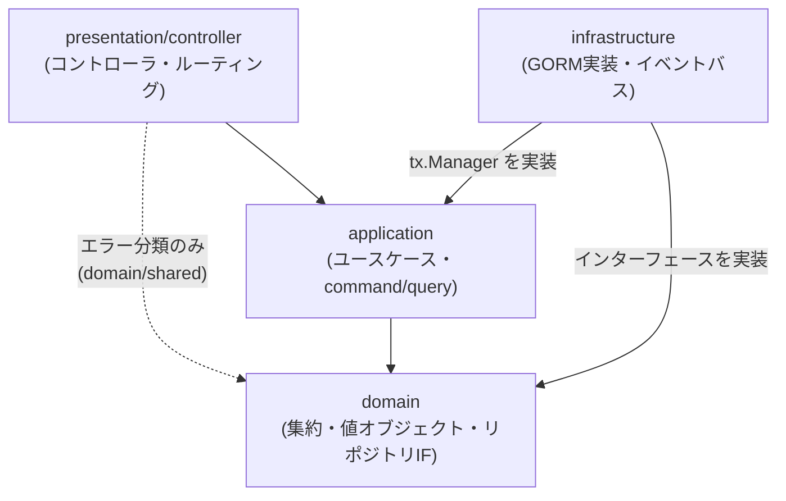
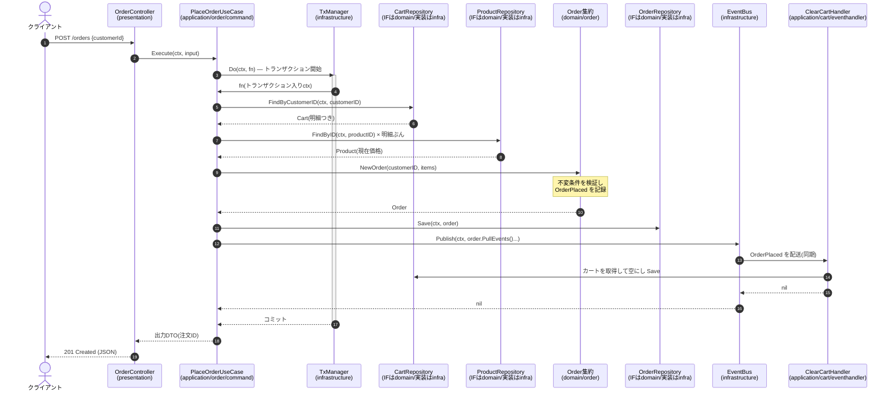
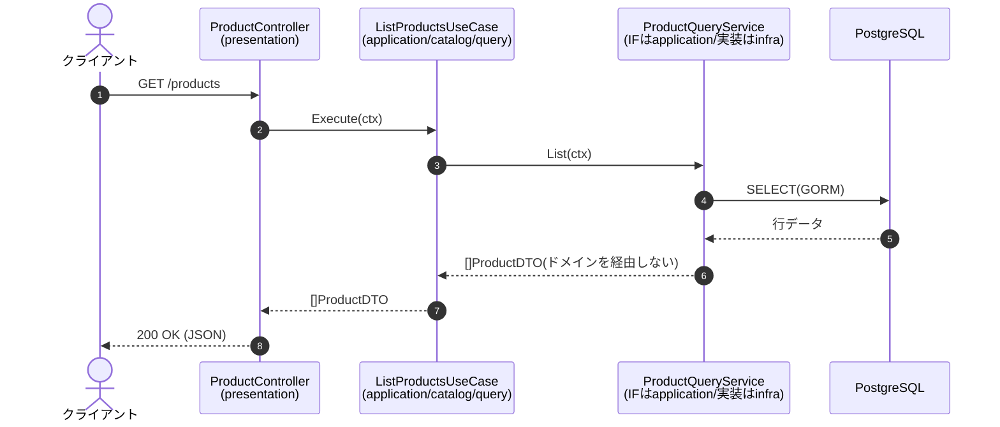

# 実行順序の図解

リクエストが各層をどの順序で通るかを図で示します。オニオンアーキテクチャでは「依存の向き」と「実行時の呼び出し順」が別物であることが分かりにくいため、まず依存関係を確認してから、command / query それぞれの実行順序を追います。

## 層の依存関係

依存はつねに外側から内側(ドメイン)へ向かいます。ドメイン層はどの層にも依存しません。infrastructure がドメインに依存する(リポジトリIFを実装する)方向であって、その逆ではない点がオニオンアーキテクチャの核心です。



なお、presentation 層は基本的に application 層だけを呼びますが、エラーを HTTP ステータスへ分類するために `domain/shared` のエラー種別だけは直接参照します(点線)。外側の層が内側の層に依存すること自体はオニオンアーキテクチャのルール上問題ありません — 禁止されているのは内側から外側への依存です。

## 起動時の組み立て順序(cmd/api)

実行時に内側の層が外側を呼べるのは、起動時に依存が注入(DI)されているためです。この組み立ては `github.com/almondoo/wire`(コンパイル時 DI コード生成ツール)が生成しています — `wire.go` が「どのプロバイダをどう組み合わせるか」を書いた設計図、`wire_gen.go` がそこから生成された実際の組み立てコード(`initializeServer` 関数)です。生成コマンドは以下の通りです。

```sh
go run github.com/almondoo/wire/cmd/wire ./cmd/api
```

`main.go` はもはや依存を手で組み立てず、`initializeServer(dsn)` を呼んで `*http.ServeMux` を受け取るだけになりました。生成されたコードがたどる組み立て順序自体は、手書き DI だった頃と変わらず内側の実装から順に行われます。

1. DB 接続を開く(`persistence.NewDB`)
2. リポジトリ実装・クエリサービス実装を生成(GORM 依存)
3. イベントバスを生成し、イベントハンドラを購読登録
4. ユースケースを生成(リポジトリIF・`tx.Manager`・`EventPublisher` を注入)
5. HTTP コントローラを生成し、ルーティングに登録
6. サーバー起動

## command の実行順序 — 注文確定(POST /orders)

もっとも登場人物が多い「注文確定」を例にします。カートを読み、商品の現在価格を引き、注文集約を生成して保存し、`OrderPlaced` イベントでカートを空にする、という一連の流れです。



補足を2点。

- イベント発行は同一トランザクション内で同期実行しています。「注文は確定したがカートが空にならない」という不整合を避ける、このサンプルなりの割り切りです。実運用の分散構成では outbox パターンや非同期メッセージングを検討することになります。
- 集約(Order)はイベントを「記録」するだけで、発行のタイミングはユースケースが握ります。ドメイン層をインフラ(バス)から切り離すための分担です。

## query の実行順序 — 商品一覧(GET /products)

query はドメイン層を通りません。クエリサービス(application 層でIF定義・infrastructure 層で GORM 実装)が DB から直接 DTO を組み立てます。集約の不変条件は書き込み時に守られているため、読み取りで再構築するコストを払わない、という軽量 CQRS の判断です。



## エラーの変換順序

ドメイン層が返すエラーは、presentation 層で HTTP ステータスに変換されます。ドメイン層は HTTP を知らないため、エラーの「種類」だけを表現します。

| ドメイン層のエラー | 意味 | HTTP ステータス |
|---|---|---|
| `shared.ErrNotFound`(ラップされる) | 対象が存在しない | 404 |
| `shared.NewDomainRuleError(...)` | ビジネスルール違反(例: 在庫上限超過、不正な状態遷移) | 422 |
| 上記以外 | 想定外の失敗 | 500 |
