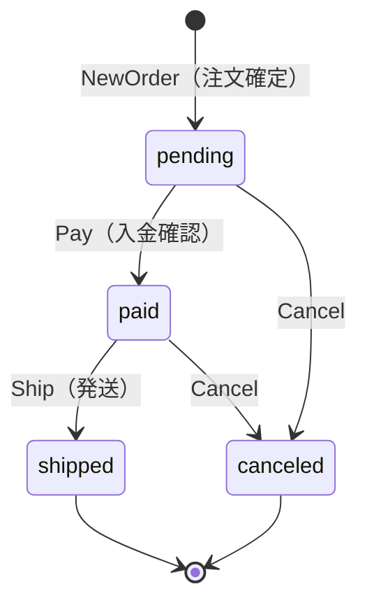

# order コンテキスト（ドメイン層）

order は「顧客が何を注文し、その注文が今どういう状態にあるか」を管理する
境界づけられたコンテキスト（Bounded Context）である。

## 集約の境界

`Order` を集約ルートとし、`OrderItem`（明細）を内部の値オブジェクトとして
持つ。集約が守る不変条件は次の 2 つである。

1. 注文は必ず 1 件以上の明細を持つ（明細が 0 件の注文は業務的に無意味）。
2. 状態は決められた遷移規則（下記のステートマシン）に従ってのみ変化する。

`Order` は `cart` パッケージ・`catalog` パッケージを一切 import しない。
カートの中身や商品の最新価格を必要とする場面（＝注文の組み立て）は
ドメイン層ではなく、アプリケーション層の `PlaceOrderUseCase` が
それぞれのドメイン・リポジトリを横断して担当する。これは「1 つの
集約は 1 つのコンテキストの中で完結させ、コンテキストをまたぐ調整は
アプリケーション層に置く」という DDD の定石に従った設計である。

## なぜ OrderItem は商品への参照ではなくスナップショットを持つのか

`cart.CartItem` は `ProductID` だけを持ち、価格は都度 catalog を参照する
設計だった。対して `OrderItem` は `productName` と `unitPrice` を
「注文確定時点の値」としてコピーして保持する（スナップショット）。

理由は、注文が「過去のある時点で成立した取引の記録」だからである。
注文確定後に商品の値段が改定されたり、商品名が変更されたりしても、
過去に成立した注文の金額・内容が変わって見えてはならない
（会計・監査の観点で、過去の取引額は不変であるべき）。

そのため `OrderItem` は `catalog.Product` への参照を持たず、注文確定の
瞬間に必要な情報を「写し取って」自分自身の中に保持する。これにより、
catalog 側でその後何が起きても過去の注文は当時の事実のまま不変であり
続けられる。

## 状態機械（State Machine）

上図にない遷移（例: `shipped` から `Cancel`、`pending` から直接
`Ship`）はすべて `shared.DomainRuleError` として拒否される。エラー
メッセージには「現在どの状態にあるか」を含め、呼び出し側が原因を
すぐに把握できるようにしている。

状態遷移の判断ロジックを `Order` 集約のメソッド（`Pay`/`Ship`/`Cancel`）に
閉じ込めているのは、「今どの状態からどの状態へ遷移できるか」という
業務ルールが、アプリケーション層やプレゼンテーション層に漏れ出して
分散してしまうのを防ぐためである。呼び出し側は `Order` のメソッドを
呼ぶだけでよく、遷移の可否そのものを自前で判定する必要がない。

## イベントの記録と配信の分離

`Order` は `shared.AggregateBase` を埋め込み、`NewOrder`（注文確定）の
タイミングで `OrderPlaced` イベントを `Record` する。しかしこの時点では
まだ誰にも配信されていない。

配信（`shared.EventPublisher.Publish`）は、アプリケーション層の
`PlaceOrderUseCase` がリポジトリへの `Save` が成功した「後」に
`PullEvents` で取り出して行う。この順序を守る理由は次の通りである。

- 集約はドメインルールを守ることだけに責任を持ち、「いつ・どうやって」
  イベントを外部に伝えるかを知るべきではない（単一責任の原則）。
- イベントは「永続化されて初めて確定した事実」である。もし `Save` の前や
  `Save` と同時にイベントを配信してしまうと、後続の DB 書き込みが
  失敗した場合に「実際には起きなかったこと」を配信してしまう不整合が
  生じる。

なお `ReconstructOrder`（DB からの復元）は `OrderPlaced` を記録しない。
これは「今まさに起きた出来事」だけをイベントとして扱うためであり、
過去の注文を読み込むたびに再度イベントを発火させると、カートを
何度も空にする等の意図しない副作用の再発火につながってしまう。

本サンプルでは学習のしやすさを優先し、同期のインメモリイベントバス
（`internal/infrastructure/event.Bus`）を採用している。これにより
「注文確定 → カートを空にする」という一連の処理が同一トランザクション
内で完結し、途中でクラッシュしても中途半端な状態が残らない。実際の
プロダクションでは Outbox パターン（イベントをまず Outbox テーブルに
書き、別プロセスが非同期に配信する）を採用し、配信の信頼性と
ユースケースの応答性を両立させることが多い。詳細は
`internal/infrastructure/event/bus.go` のコメントを参照。
