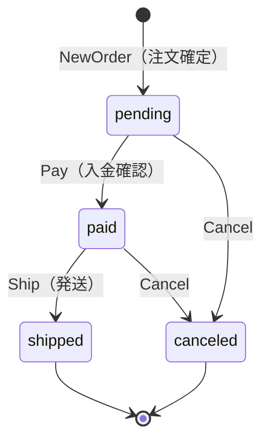

# order コンテキスト（ドメイン層）

order は「顧客が何を注文し、その注文が今どういう状態にあるか」を管理する
境界づけられたコンテキスト（Bounded Context）である。

## 集約の境界

`Order` を集約ルートとし、`OrderItem`（明細）を内部の値オブジェクトとして
持つ。集約が守る不変条件は次の 2 つである。

1. 注文は必ず 1 件以上の明細を持つ（明細が 0 件の注文は業務的に無意味）。
2. 状態は決められた遷移規則（下記のステートマシン）に従ってのみ変化する。

`Order` は `cart` パッケージ・`catalog` パッケージを一切 import しない。
カートの中身や商品の最新価格を必要とする場面（＝注文の組み立て）は
ドメイン層ではなく、アプリケーション層の `PlaceOrderUseCase` が
それぞれのドメイン・リポジトリを横断して担当する。これは「1 つの
集約は 1 つのコンテキストの中で完結させ、コンテキストをまたぐ調整は
アプリケーション層に置く」という DDD の定石に従った設計である。

## なぜ OrderItem は商品への参照ではなくスナップショットを持つのか

`cart.CartItem` は `ProductID` だけを持ち、価格は都度 catalog を参照する
設計だった。対して `OrderItem` は `productName` と `unitPrice` を
「注文確定時点の値」としてコピーして保持する（スナップショット）。

理由は、注文が「過去のある時点で成立した取引の記録」だからである。
注文確定後に商品の値段が改定されたり、商品名が変更されたりしても、
過去に成立した注文の金額・内容が変わって見えてはならない
（会計・監査の観点で、過去の取引額は不変であるべき）。

そのため `OrderItem` は `catalog.Product` への参照を持たず、注文確定の
瞬間に必要な情報を「写し取って」自分自身の中に保持する。これにより、
catalog 側でその後何が起きても過去の注文は当時の事実のまま不変であり
続けられる。

## 状態機械（State Machine）

上図にない遷移（例: `shipped` から `Cancel`、`pending` から直接
`Ship`）はすべて `shared.DomainRuleError` として拒否される。エラー
メッセージには「現在どの状態にあるか」を含め、呼び出し側が原因を
すぐに把握できるようにしている。

状態遷移の判断ロジックを `Order` 集約のメソッド（`Pay`/`Ship`/`Cancel`）に
閉じ込めているのは、「今どの状態からどの状態へ遷移できるか」という
業務ルールが、アプリケーション層やプレゼンテーション層に漏れ出して
分散してしまうのを防ぐためである。呼び出し側は `Order` のメソッドを
呼ぶだけでよく、遷移の可否そのものを自前で判定する必要がない。

## 割引（クーポン適用）

`Order` は `couponCode`（適用済みクーポンのコード。空文字列は未適用）と
`discountAmount`（適用済みの割引額）を持つ。「どのクーポンが有効か」
「割引額をいくらにするか」を計算するのは `coupon` コンテキストの責務だが、
「その割引を注文に適用してよいか」という可否判断（状態・二重適用・金額の
整合性）は注文コンテキスト自身の不変条件であるため、`Order.ApplyDiscount`
に閉じ込めている。

- `pending` 状態の注文にのみ適用できる（入金・発送後に割引を後付けする
  ことは業務的に許されない）。
- 一度適用したクーポンを別のクーポンで上書きすることはできない
  （二重適用の禁止）。
- 割引額が注文合計を超える適用は拒否する（`shared.Money.Subtract` が
  負の金額を許さないことを利用して検証している）。

割引適用後に実際へ支払うべき金額は `Order.PayableAmount()`
（`TotalAmount() - DiscountAmount()`）で取得する。クーポンを誰が・いつ
検索し、消費（`coupon.Coupon.Use`）するかは `order` パッケージの関知する
ところではなく、`PlaceOrderUseCase`（アプリケーション層）が `coupon`
コンテキストと `order` コンテキストの両方を橋渡しする（詳細は
`internal/application/usecase/order/place_order.go` を参照）。

## 注文確定後のカートのクリアは application 層の直接呼び出し

「注文が確定したらカートを空にする」という cart コンテキストへの反応は、
`Order` 集約自身の責務ではない。`order` パッケージは `cart` パッケージを
一切知らない（import しない）ままであり、アプリケーション層の
`PlaceOrderUseCase` が `Order` の `Save` 成功後に `cart.Repository` を
直接呼び出してカートを空にする（同一トランザクション内で行うため、
「注文は確定したがカートが空にならない」という不整合は起きない）。

以前はここでドメインイベント（`OrderPlaced`）を発行し、cart 側の
イベントハンドラが購読してカートを空にする、という疎結合な設計を
採っていた。しかし本サンプルでは仕組みの理解コストを下げるため直接
呼び出しに変更した。application 層での直接呼び出しは order→cart の
依存を生む（結合度は上がる）一方、処理の流れが一目で追える。
コンテキストをまたぐ反応が増えてきたらドメインイベント + 購読へ
戻すのが定石である。詳細な比較は
`internal/application/README.md`「コンテキストをまたぐ直接呼び出し」を
参照。

**このコストは order→cart の1対1の結合だけでは説明しきれない。**
実際には `PlaceOrderUseCase` は cart に加えて catalog・customer・
inventory・coupon の計 5 コンテキストのドメインパッケージを import し、
1 トランザクションで最大 4 集約種・約 23 集約インスタンス（Cart × 1、
Order × 1、Stock × カート明細数（最大 20）、Coupon × 最大 1）を更新する。
`ShipOrderUseCase` も Order・Shipment・Stock の 3 集約種を 1 トランザクション
で更新する。これは Vernon の「1 トランザクション = 1 集約インスタンス」
ルールからの明確な逸脱であり、本サンプルでは Vernon が挙げる逸脱理由の
うち Reason Two（イベント基盤という技術的手段を意図的に持たない）に
該当する意図的な選択である。集約数・依存コンテキスト数の詳細、本番規模
でのロック競合・ロールバック範囲・段階的分離の難しさといった帰結は
[`internal/application/README.md`](../../application/README.md)
「コンテキストをまたぐ直接呼び出し」および
[ddd-research.md](../../../docs/ddd-research.md) の Vernon のルールと
"Reasons To Break the Rules" を参照。
