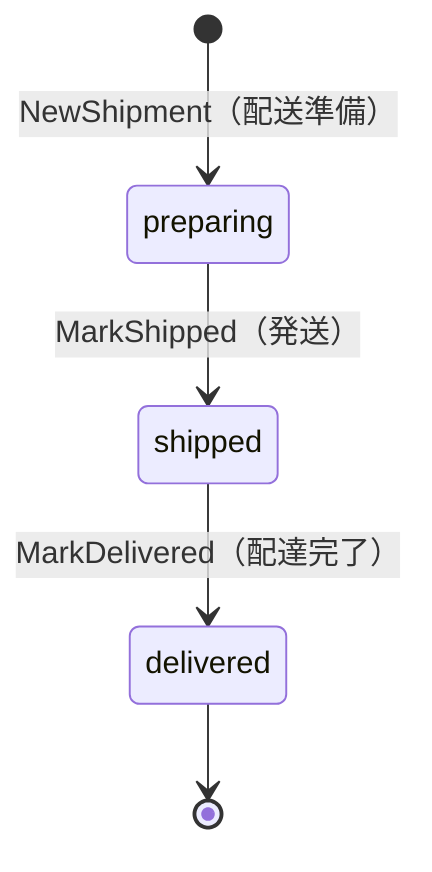

# shipping コンテキスト（ドメイン層）

shipping は「注文された商品がどの住所へ、どういう状態で配送されているか」を
管理する境界づけられたコンテキスト（Bounded Context）である。

## 集約の境界

`Shipment` を集約ルートとする、`id` / `orderID` / `address` / `status` の
4 つのフィールドだけを持つ小さな集約である。集約が守る不変条件は次の
2 つである。

1. 配送先住所（`address`）は必ず設定されている（空文字列の配送は業務的に
   意味を持たない）。
2. 状態は決められた遷移規則（下記のステートマシン）に従ってのみ変化する。

`Shipment` は `order` パッケージを一切 import しない。どの注文に対する
配送かは `shipping.OrderID`（shipping コンテキスト自身が定義する型）で
参照するのみであり、`order.Order` 集約そのものへの参照は持たない。これは
「1 つの集約は 1 つのコンテキストの中で完結させ、コンテキストをまたぐ
調整はアプリケーション層に置く」という DDD の定石に従った設計である
（`internal/domain/order/README.md` の集約境界の説明と同じ考え方）。

## なぜ address は住所への参照ではなくスナップショットを持つのか

`Shipment.address` は顧客の住所情報そのもの（例えば customer コンテキストが
持つ住所エンティティ）への参照ではなく、配送時点の住所を文字列として
「写し取った」スナップショットである。

理由は、配送記録も注文と同じく「過去のある時点で確定した事実の記録」
だからである。配送を手配した後に顧客が住所を変更しても、既に確定した
配送記録の宛先が書き換わって見えてはならない（過去にどこへ送ったかという
事実は不変であるべき）。これは `order.OrderItem` が商品名・単価を
スナップショットとして持つ理由（`internal/domain/order/README.md` を参照）
と全く同じ設計判断である。

## 状態機械（State Machine）

上図にない遷移（例: `preparing` から直接 `MarkDelivered`、`delivered`
から再度 `MarkShipped`）はすべて `shared.DomainRuleError` として拒否
される。エラーメッセージには「現在どの状態にあるか」を含め、呼び出し側が
原因をすぐに把握できるようにしている。

状態遷移の判断ロジックを `Shipment` 集約のメソッド（`MarkShipped`/
`MarkDelivered`）に閉じ込めているのは、「今どの状態からどの状態へ遷移
できるか」という業務ルールが、アプリケーション層やプレゼンテーション層に
漏れ出して分散してしまうのを防ぐためである。呼び出し側は `Shipment` の
メソッドを呼ぶだけでよく、遷移の可否そのものを自前で判定する必要がない。

## 注文コンテキストとの関係

`shipping` パッケージは `order` パッケージに一切依存しないが、業務的には
「注文が支払い済みになったら配送を手配する」という関係を持つ。この
コンテキストをまたぐ調整は `shipping` 集約自身の責務ではなく、実装済みの
[`ShipOrderUseCase`](../../../internal/application/usecase/order/ship_order.go)
（アプリケーション層）が担っている。`order.Repository` / `customer.Repository` /
`shipping.Repository` / `inventory.Repository` の 4 つを扱い、次の手順で
1 トランザクション内に連携をまとめる。

1. `Order.Ship()` を呼び、注文自身の状態を `paid` から `shipped` へ遷移させる。
2. 顧客のデフォルト配送先住所を取得し、1 行の文字列に整形する。
3. `shipping.NewShipment` で `Shipment` を生成し、`MarkShipped` で発送指示と
   同時に出荷済みにして保存する。
4. 注文明細ごとに `inventory.Stock.ConsumeReserved` を呼び、注文確定時点
   （`PlaceOrderUseCase`）で引き当てておいた在庫を実際に払い出す。

`order.Order.Ship()` が注文自身の状態を `shipped` にする一方、実際の配送記録
（`Shipment`）を作るのはこのアプリケーション層のオーケストレーションの
役目であり、`order` 集約・`shipping` 集約のどちらも互いのドメインモデルを
一切知らないままこの連携が成立する（`order/README.md` 「注文確定後の
カートのクリアは application 層の直接呼び出し」と同じ設計方針）。この
ユースケースは `POST /orders/{id}/ship` から到達可能である。
